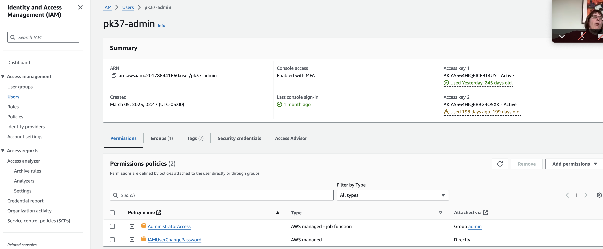

## Setup procedures:
NOTE: steps 1 to 2b are for first-time instance-manager setups. 
NOTE: steps 3 and 4 are for regular usage. 

### 1. Create an AWS IAM user through your own AWS account:
1. Create an IAM user through AWS IAM (while you are logged in as your root account). See image below details of an example IAM user (pk37-admin) configuration:  

2. Send Patrick your AWS account ID (top right hand corner) so that he can create an AWS role on the UM AWS account for you. 
2. Test out assume role (switching to our UM AWS account): login to that IAM user, and you should be able to “switch roles” from that account (to switch roles, press the top right button and you will see switch roles button in the menu). Once on the switch roles menu, enter these details:
```
accountID: <UM-AWS-account-ID-to-be-provided-by-patrick>
role: <to-be-provided-by-patrick>
```

### 2. Install and configure boto3 and AWS CLI with your own AWS account:
```
git clone https://github.com/unknown-cstdio/instance-manager.git
(Specific instructions assuming the following AMI: ubuntu/images/hvm-ssd/ubuntu-jammy-22.04-amd64-server-20231207)
sudo apt-get update
sudo apt install python3-pip
pip install boto3
sudo apt install unzip
curl "https://awscli.amazonaws.com/awscli-exe-linux-x86_64.zip" -o "awscliv2.zip"
unzip awscliv2.zip
sudo ./aws/install
aws configure # use access key and secret access key provided by Patrick, which will be used as the default profile which is the pk37-admin IAM user
```

### 2b. Install other required instance-manager dependencies
```
pip install pandas
pip install adal
```

### 3. Using AWS CLI, Access our UM AWS account, through your own AWS account:
Add assume role credentials (Execute the following whenever you need to refresh your credentials, since these will timeout quite often)
```
cd instance-manager
python3 misc/refresh-credentials.py
```
If you don't do this, you will encounter the error: "Request has expired."

### 4. Start using the instance-manager API:
Still a work in progress.
```
cd instance-manager

# Refer to example usage at the bottom of api.py 
python3 api.py

UPDATE: 
python3 api.py [UM] [region] [num of instances]
example: python3 api.py UM us-east-1 2
```

Some points to note:
- No matter how the API is used, the "choose_session" function must have been run (line 24 currently)

<!-- 1. Login as your IAM user. Create an AWS role with the following instructions: 
2. ```bash
aws sts assume-role --role-arn arn:aws:iam::590184057477:role/spotproxy-pat-umich --role-session-name "SpotProxyPatRoleSession1" --profile "default" > assume-role-output.txt
```

3. Copy the output of assume-role-output.txt into ~/.aws/credentials -->
